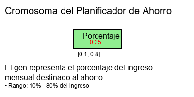

# TALLER ALGORITMOS GENÉTICOS

**Breyner Andres Taborda Agudelo**  
breyner_taborda23191@elpoli.edu.co  

**Jhon Sebastian Agudelo Sierra**  
jhon_agudelo23191@elpoli.edu.co  

**Politécnico Colombiano Jaime Isaza Cadavid**

## 1. Algoritmo genético para caída de Paracaidista

### 1.1 Descripción general

El problema abordado consiste en optimizar el aterrizaje de un paracaidista en una simulación física bidimensional, donde el objetivo es lograr un aterrizaje lo más suave y controlado posible. El paracaidista cae desde una altura inicial hacia el suelo, y su comportamiento está determinado por cuatro parámetros genéticos: la velocidad de caída (V), el balanceo lateral (B), la estabilidad (S) y la fuerza (F). Estos genes influyen en la física de la caída, incluyendo la velocidad vertical, el movimiento lateral y la rotación del paracaidista.

El desafío radica en encontrar la combinación óptima de estos parámetros que permita un aterrizaje con mínimo ángulo de inclinación y máxima estabilidad, evitando aterrizajes bruscos o inestables. El algoritmo genético se emplea para explorar el espacio de soluciones de manera eficiente, evolucionando una población de individuos a través de generaciones hasta converger en una configuración óptima.

### 1.2 Función objetivo

La función objetivo evalúa la calidad del aterrizaje del paracaidista mediante una métrica de fitness que combina múltiples factores. Se calcula considerando el ángulo de aterrizaje, la estabilidad del paracaidista y factores adicionales codificados en los genes. Un fitness alto indica un aterrizaje suave y controlado, mientras que valores bajos corresponden a aterrizajes inestables o bruscos.

La ecuación utilizada es:

**Ecuación 1:**  
Z = max(0.0, 0.6 − |angulo|) + 0.5 × S + 0.3 × F

Donde:
- angulo es el ángulo de rotación al momento del aterrizaje
- S es el gen de estabilidad
- F es el factor fuerza

### 1.3 Definición de población

En este algoritmo genético, la población está compuesta por individuos que representan diferentes configuraciones de parámetros para el paracaidista. Cada individuo contiene un cromosoma con cuatro genes reales que codifican los parámetros físicos: velocidad de caída (V), balanceo lateral (B), estabilidad (S) y fuerza (F). La población inicial se genera aleatoriamente dentro de límites predefinidos para cada gen, asegurando diversidad genética.

El tamaño de la población se establece en 30 individuos para mantener un equilibrio entre diversidad y eficiencia computacional. Cada individuo se evalúa mediante la simulación de su caída, obteniendo un valor de fitness que determina su aptitud para sobrevivir y reproducirse en las siguientes generaciones.

### 1.4 Definición del cromosoma

El cromosoma está compuesto por cuatro genes reales que representan los parámetros físicos del paracaidista. Cada gen tiene límites específicos que definen el rango válido de valores:

- V (velocidad de caída): [1.5, 6.0]
- B (balanceo lateral): [-1.5, 1.5]  
- S (estabilidad): [0.0, 1.0]
- F (fuerza): [0.0, 1.0]

Esta estructura permite una representación continua y precisa de los parámetros físicos, facilitando la optimización gradual a través del algoritmo genético.

### 1.5 Estrategia de cruce y mutación

El algoritmo implementa un cruce de un punto para combinar los genes de dos padres y generar descendencia. Con una probabilidad de cruce del 80%, se selecciona aleatoriamente un punto de corte en el cromosoma de cuatro genes, intercambiando los segmentos correspondientes entre los padres para crear dos hijos. Esta técnica preserva la estructura genética mientras introduce variabilidad al combinar características de individuos aptos.

La mutación se aplica con una probabilidad del 5% por gen, utilizando una distribución gaussiana centrada en cero con una desviación estándar del 10% del rango del gen. Este enfoque permite exploraciones locales del espacio de soluciones sin alterar drásticamente los valores óptimos ya encontrados. Los valores mutados se mantienen dentro de los límites predefinidos para cada gen, asegurando la viabilidad de las soluciones generadas.

### 1.6 Aplicación construida

La aplicación fue desarrollada utilizando Python como lenguaje principal, con la biblioteca Pygame para la simulación visual y física del paracaidista. La interfaz gráfica permite la visualización en tiempo real de la caída, mostrando el movimiento del paracaidista, su rotación y el momento del aterrizaje. Incluye un panel lateral que muestra los valores actuales de los genes (V, B, S, F) y el fitness del mejor individuo en cada generación.

La arquitectura del software separa claramente la lógica del algoritmo genético, la simulación física y la interfaz de usuario, facilitando el mantenimiento y la extensibilidad del código.

### 1.7 Conclusiones

Los algoritmos genéticos demostraron ser una herramienta efectiva para optimizar los parámetros de aterrizaje del paracaidista, encontrando configuraciones que maximizan la estabilidad y suavidad del descenso. La representación continua de los genes permitió una exploración fina del espacio de soluciones, resultando en mejoras significativas en el fitness de los individuos a través de las generaciones.

La integración de la simulación visual con el algoritmo genético no solo facilitó la evaluación del fitness, sino que también proporcionó una comprensión intuitiva del comportamiento físico, permitiendo ajustes manuales basados en la observación del proceso de evolución.

## 2. Algoritmo genético para Planificador de Ahorro

### 2.1 Descripción general

El problema consiste en determinar el porcentaje óptimo de ingreso mensual que una persona debe destinar al ahorro para alcanzar una meta financiera específica dentro de un plazo determinado. El algoritmo genético busca encontrar el porcentaje ideal que minimice la diferencia entre el ahorro total acumulado y la meta establecida, considerando restricciones realistas en los porcentajes de ahorro.

La planificación financiera personal requiere equilibrar el ahorro necesario con las necesidades de consumo inmediato, donde porcentajes demasiado altos pueden generar estrés financiero mientras que valores bajos pueden no alcanzar las metas. El algoritmo explora diferentes porcentajes de ahorro, simulando el crecimiento del capital a lo largo del tiempo para encontrar la solución óptima.

Este enfoque permite modelar un problema de optimización financiera donde el porcentaje de ahorro actúa como variable de decisión principal, evaluando su impacto en el cumplimiento de metas a largo plazo de manera automática y eficiente.

### 2.2 Función objetivo

La función objetivo mide la proximidad entre el ahorro total acumulado y la meta financiera establecida. Se calcula como la diferencia negativa entre el ahorro total proyectado y la meta, incentivando soluciones que se acerquen lo más posible al objetivo.

La ecuación utilizada es:

**Ecuación 1:**  
Z = −|meta_ahorro − (ingreso_mensual × porcentaje × plazo_meses)|

Donde:
- meta_ahorro es la cantidad objetivo a alcanzar
- ingreso_mensual es el ingreso mensual disponible
- porcentaje es el gen que representa la fracción del ingreso destinada al ahorro
- plazo_meses es el número de meses para alcanzar la meta

### 2.3 Definición de población

La población está conformada por individuos que representan diferentes estrategias de ahorro, cada uno codificado con un único gen real que indica el porcentaje del ingreso mensual destinado al ahorro. Los valores válidos para este gen están limitados entre 0.1 (10%) y 0.8 (80%) para mantener soluciones realistas y practicables.

Se utiliza una población de 12 individuos para mantener la diversidad genética mientras se optimiza la eficiencia computacional. Cada individuo se evalúa calculando el ahorro total proyectado y comparándolo con la meta financiera, asignando un fitness que refleja qué tan cercana está la estrategia al objetivo deseado.

### 2.4 Definición del cromosoma

El cromosoma consta de un único gen real que representa el porcentaje del ingreso mensual destinado al ahorro. Este gen toma valores entre 0.1 y 0.8, correspondientes al 10% y 80% del ingreso respectivamente, lo que permite explorar estrategias de ahorro realistas y sostenibles.

Esta estructura simple pero efectiva permite una optimización precisa del porcentaje de ahorro, considerando tanto el crecimiento del capital como las restricciones prácticas de la planificación financiera.

### 2.5 Estrategia de cruce y mutación

El cruce se implementa mediante el promedio aritmético de los genes de dos padres seleccionados, generando un descendiente con un valor intermedio que combina las características de ambos progenitores. Esta técnica de cruce simple pero efectiva permite la transmisión gradual de rasgos favorables a través de las generaciones.

La mutación se aplica con una probabilidad del 30%, reemplazando completamente el valor del gen por un nuevo valor aleatorio dentro del rango válido (0.1 a 0.8). Este enfoque permite explorar nuevas estrategias de ahorro mientras mantiene la estabilidad de soluciones prometedoras. La selección de padres se basa en los individuos mejor adaptados, asegurando que las mejores estrategias de ahorro se preserven y combinen en las generaciones siguientes.

### 2.6 Aplicación construida

La aplicación fue desarrollada utilizando Python con la biblioteca Tkinter para crear una interfaz gráfica moderna y intuitiva. La interfaz permite al usuario ingresar su ingreso mensual, la meta de ahorro total y el plazo en meses, mostrando los resultados del algoritmo genético de manera clara y organizada.

La interfaz se divide en dos paneles: uno para la entrada de datos con campos para ingreso, meta y plazo, y otro para mostrar los resultados incluyendo el porcentaje óptimo de ahorro, el monto mensual y el total proyectado.

### 2.7 Conclusiones

Los algoritmos genéticos demostraron ser una herramienta poderosa para la planificación financiera personal, permitiendo encontrar porcentajes óptimos de ahorro que se ajustan a metas específicas de manera automática y eficiente.

La integración del algoritmo con una interfaz gráfica intuitiva hace que la herramienta sea accesible para usuarios no técnicos, permitiendo la toma de decisiones financieras informadas basadas en optimización matemática en lugar de estimaciones subjetivas.